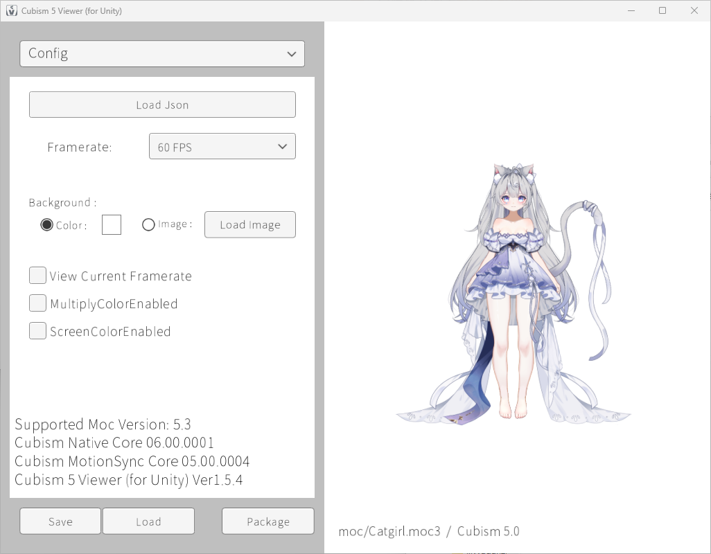
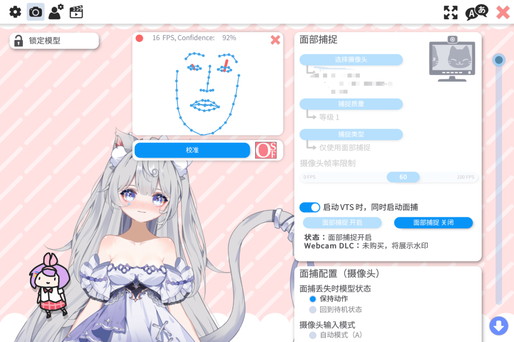

# Molili-Live2d-Extract

某恶俗圈钱文爱游戏的Live2d模型美术资源文件提取，手动修补了model3.json文件缺失问题。

游戏Steam商店页面地址；https://store.steampowered.com/app/4141770

~~后续会修补为支持VTube Studio(VTS)一键加载的资源类型，并逐步支持表情动作快捷键切换。~~
[VTS包已修复并上传，请自行导入至VTS](./vts_models/)

已知限制：

- HitAreas 留空：ArtMesh 名为通用 ArtMesh1-1025 ，无法自动匹配 Head/Body/Face；如需点击交互需在 VTS 内手动配置
- pose3.json 缺失：源资产未配置 pose 数据

使用方式: 下载Cubism并加载"Catgirl.model3.json"即可。"Live2d"文件夹内的文件结构不要动，除非你具有修补此项目的能力。

预览:

版权声明: 
**针对此仓库内的所有资源，除了被约稿人（原画师）外的所有人，包括我，均不具有其所有权。贱公司亦如此。**
